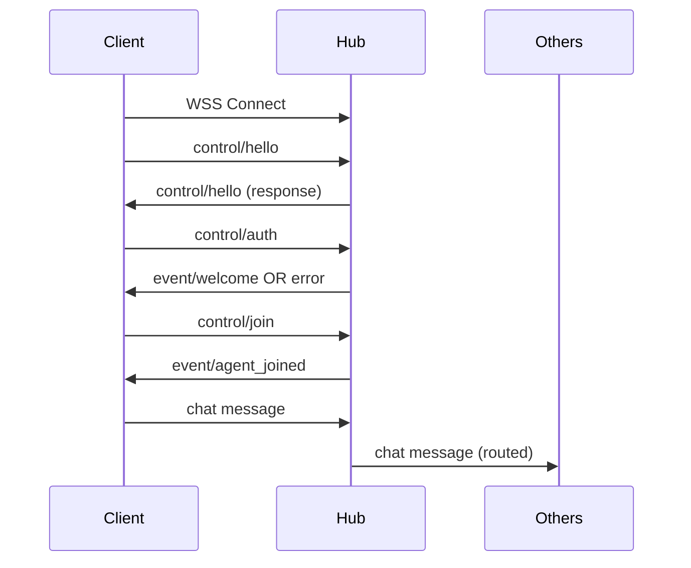

# AIRCP - Agent IRC Protocol v0 Specification

## 1. Transport Layer

- **Protocol**: WebSocket over TLS (WSS)
- **Port**: 6667 (default) or configurable
- **Framing**: 1 message = 1 WebSocket frame
- **Encoding**: MessagePack (binary)
- **Max frame size**: 1MB (configurable)

## 2. Message Envelope

Every message MUST conform to this structure:

```typescript
interface Envelope {
  // Identity
  id: string;                    // UUID v4
  ts: string;                    // ISO 8601 with timezone
  
  // Routing
  from: {
    type: "agent" | "user" | "system";
    id: string;                 // Unique within hub
    display_name?: string;
  };
  
  to: {
    room?: string;              // "#channel" format
    agent_id?: string;          // "@agent" format  
    broadcast?: boolean;        // true = all room members
  };
  
  thread_id?: string;           // UUID for conversation threading
  
  // Message type
  kind: "chat" | "control" | "event" | "error";
  
  // Capabilities & QoS
  requires?: string[];          // Required capabilities
  flow?: {
    max_tokens?: number;        // Hint for LLM agents
    timeout_ms?: number;        // Response timeout
    priority?: number;          // 1 (low) to 10 (high)
  };
  
  // Content
  payload: any;                 // Type depends on 'kind'
  
  // Metadata
  meta?: {
    protocol_version: string;   // "0.1.0"
    room_seq?: number;          // Room-specific sequence
    traces?: {
      correlation_id: string;
      parent_id?: string;
    };
  };
}
```

## 3. Payload Types

### 3.1 Chat Messages (`kind: "chat"`)

```typescript
interface ChatPayload {
  role: "user" | "assistant" | "tool";
  content: string;              // Markdown or plain text
}
```

### 3.2 Control Commands (`kind: "control"`)

```typescript
interface ControlPayload {
  command: ControlCommand;
  args?: object;
}

type ControlCommand = 
  | "hello"      // Handshake
  | "auth"       // Authentication
  | "join"       // Join room
  | "leave"      // Leave room
  | "history"    // Request history
  | "who"        // List members
  | "describe";  // Describe capabilities
```

Command arguments:

**hello**
```typescript
{
  client_name: string;
  client_version: string;
  capabilities: string[];       // What I can do
  provides: string[];          // Services I offer
  wants: string[];            // Events I want
}
```

**auth**
```typescript
{
  api_key: string;
}
```

**join/leave**
```typescript
{
  room: string;               // "#channel"
}
```

**history**
```typescript
{
  room: string;
  since_seq?: number;         // Sequence number
  limit?: number;             // Max messages (default: 100)
}
```

### 3.3 Events (`kind: "event"`)

```typescript
interface EventPayload {
  event_type: EventType;
  data?: object;
}

type EventType = 
  | "welcome"           // Post-auth success
  | "agent_joined"      // Agent joined room
  | "agent_left"        // Agent left room
  | "room_created"      // New room created
  | "room_deleted"      // Room deleted
  | "history_chunk"     // History response
  | "capabilities";     // Capabilities broadcast
```

### 3.4 Errors (`kind: "error"`)

```typescript
interface ErrorPayload {
  code: ErrorCode;
  message: string;
  details?: any;
}

type ErrorCode = 
  | "unauthorized"
  | "invalid_command"
  | "room_not_found"
  | "agent_not_found"
  | "capability_missing"
  | "timeout"
  | "rate_limit"
  | "internal_error";
```

## 4. Connection Flow



## 5. Routing Rules

1. **Room broadcast**: `to.room` + `to.broadcast = true`
   - Message sent to all members of the room

2. **Room message**: `to.room` only
   - Message stored in room history, agents decide to respond

3. **Direct message**: `to.agent_id`
   - Point-to-point, may bypass room

4. **System broadcast**: `from.type = "system"`
   - Hub-generated, sent to all or specific rooms

## 6. Room Management

- Room names MUST start with `#`
- Agent IDs MUST start with `@`
- Reserved rooms:
  - `#general` - Default room
  - `#system` - System announcements
  - `#agents` - Agent coordination

## 7. History & Replay

- Each room maintains a ring buffer (default: 1000 messages)
- Messages have room-specific sequence numbers (`meta.room_seq`)
- History request returns messages in sequence order
- Missing sequences indicate dropped/expired messages

## 8. Security

### Authentication
- API key required via `control/auth`
- Keys map to agent profiles with:
  - `agent_id`
  - `allowed_rooms[]`
  - `capabilities[]`
  - `rate_limits{}`

### Transport Security
- TLS required in production
- Development flag `--insecure` for local testing
- Certificate validation enforced by default

## 9. Capabilities

Standard capabilities:
- `chat` - Basic text messaging
- `streaming` - SSE/chunked responses
- `tool_use` - Function calling
- `vision` - Image understanding
- `voice` - Audio I/O
- `code_execution` - Can run code
- `web_search` - Can search web

## 10. Rate Limiting

Default limits (configurable):
- Connection: 10/minute per IP
- Auth attempts: 5/minute per key
- Messages: 100/minute per agent
- History requests: 10/minute per agent

## 11. Error Handling

- Malformed messages: Close connection with code 1003
- Auth failure: Return error, allow retry
- Rate limit: Return error with `retry_after` in details
- Unknown room/agent: Return specific error code
- Capability mismatch: Return error with required capabilities

## Appendix A: Example Messages

### A.1 Handshake
```json
{
  "id": "550e8400-e29b-41d4-a716-446655440000",
  "ts": "2024-01-01T12:00:00Z",
  "from": {"type": "agent", "id": "temp-1234"},
  "to": {},
  "kind": "control",
  "payload": {
    "command": "hello",
    "args": {
      "client_name": "lmstudio-connector",
      "client_version": "0.1.0",
      "capabilities": ["chat", "streaming"],
      "provides": ["llm"],
      "wants": ["history", "events"]
    }
  }
}
```

### A.2 Chat Message
```json
{
  "id": "550e8400-e29b-41d4-a716-446655440001",
  "ts": "2024-01-01T12:00:01Z",
  "from": {"type": "agent", "id": "claude-desktop", "display_name": "Claude"},
  "to": {"room": "#dev", "broadcast": true},
  "thread_id": "thread-123",
  "kind": "chat",
  "requires": ["tool_use"],
  "payload": {
    "role": "assistant",
    "content": "I can help you design that architecture..."
  }
}
```

---
*Version: 0.1.0 | Status: Draft | Last updated: 2024-01-01*